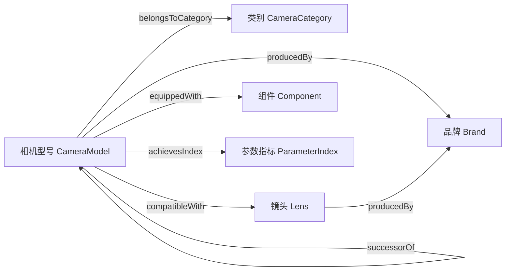

# 面向消费决策的相机领域知识图谱设计与实现

## 一、研究背景

数码相机选购同时涉及品牌、型号、类别、价格、发布时间、传感器画幅、机身重量、镜头卡口、视频规格、连拍性能、处理器、传感器等多维信息。普通消费者往往需要在大量参数页面、评测文章和电商信息之间反复比较，容易出现信息碎片化、概念混淆和决策成本过高的问题。知识图谱将实体、属性和关系组织为结构化网络，适合表达“某型号由某品牌生产”“某型号属于某类别”“某机身兼容某镜头”“某型号达到某视频或连拍指标”等语义关系，因此可以作为相机消费决策支持系统的基础。

本作业围绕“品牌、型号、类别、价格”四个核心维度，结合已有相机节点与关系数据，设计一个轻量级相机知识图谱。图谱不追求覆盖所有相机产品，而强调可解释、可扩展和可展示：既能回答基础查询，也能支持按价格区间、画幅类别、品牌偏好和性能指标进行比较。

## 二、文献综述

### 2.1 知识图谱的基本理论

知识图谱通常以实体、关系和属性为核心构成三元组或属性图结构。Hogan 等对知识图谱的数据模型、模式、身份、上下文、抽取、质量评估和发布流程进行了系统综述，说明知识图谱不仅是数据存储方式，也是一种知识组织与推理框架[1]。Paulheim 强调知识图谱的细化与补全对于提升数据质量十分关键[2]。Nickel 等从关系学习角度讨论了统计关系学习与知识图谱嵌入，为后续图谱补全、链接预测和推荐应用奠定基础[3]。

知识图谱构建流程通常包括数据采集、实体识别、关系抽取、实体对齐、属性抽取、图谱存储与质量评估。对于相机领域，结构化数据可来自产品参数表，半结构化数据可来自品牌官网和电商页面，非结构化数据可来自评测文章和用户评论。由于本作业数据规模适中，采用 CSV 节点表和边表即可完成图谱原型；若扩展到真实应用，可迁移到 Neo4j、RDF 三元组库或图数据库平台。

### 2.2 知识图谱构建与信息抽取

实体识别和关系抽取是知识图谱自动构建的重要环节。Mintz 等提出远程监督关系抽取思想，利用知识库自动生成训练样本，降低人工标注成本[4]。Riedel 等进一步处理远程监督中的噪声问题[5]。Zeng 等将卷积神经网络用于关系抽取[6]，Lin 等提出句子级注意力机制以改善多实例关系抽取[7]。Lample 等和 Ma 等分别使用神经序列标注模型处理命名实体识别任务[8][9]。Devlin 等提出 BERT 后，预训练语言模型成为信息抽取的重要基础[10]。

在相机图谱中，自动抽取可以用于从评测文本中识别“Alpha 7 IV”“EOS R5 Mark II”“全画幅”“16999 元”等实体或属性，并抽取“属于类别”“搭载组件”“支持视频规格”等关系。但课程作业更适合采用人工整理加规则校验的方式，保证实体命名统一、关系类型清晰、数据可解释。

### 2.3 知识图谱表示学习与补全

知识图谱嵌入将实体和关系映射到低维向量空间，用于链接预测、关系推断和下游推荐。Bordes 等提出 TransE，将关系理解为向量平移[11]；Wang 等提出 TransH，解决一个实体在不同关系下语义不同的问题[12]；Lin 等提出 TransR，将实体和关系映射到不同空间[13]；Yang 等提出 DistMult，用双线性形式建模关系[14]；Trouillon 等提出 ComplEx，增强对非对称关系的表达[15]。Schlichtkrull 等提出 R-GCN，将图卷积用于多关系图数据[16]。Wang 等、Dai 等和 Cao 等分别从方法、应用、基准和表示空间角度综述了知识图谱嵌入研究[17][18][19]。

本作业的数据量较小，不必训练复杂嵌入模型，但表示学习思想仍能指导图谱扩展。例如若未来新增用户浏览记录，可以根据“用户-型号-品牌-类别-镜头-参数”的路径计算相似机型；若某型号缺少类别或兼容镜头关系，可通过同品牌、同卡口、同系列型号进行补全建议。

### 2.4 知识图谱推荐与消费决策

推荐系统常面临数据稀疏、冷启动和可解释性不足等问题。知识图谱能够将商品属性、品牌、类别和上下游配件引入推荐过程。Wang 等提出 DKN，将知识图谱实体用于新闻推荐[20]；RippleNet 通过在知识图谱上传播用户偏好解决推荐问题[21]；MKR 采用多任务学习联合建模推荐和知识图谱任务[22]；KGCN 使用图卷积聚合知识图谱邻域信息[23]；KGAT 通过注意力机制建模用户-物品图与知识图谱中的高阶连通性[24]。Guo 等和 Gao 等对知识图谱增强推荐进行了综述，指出图谱推荐的主要优势是可解释性、语义扩展和冷启动缓解[25][26]。

相机选购天然适合图谱推荐：消费者常以预算、品牌偏好、用途和性能指标为约束。例如“预算 15000 元以内、全画幅、适合视频”可以映射为价格过滤、类别过滤和视频指标过滤；“已有 Canon RF 镜头”可以通过兼容关系过滤机身；“想从 EOS R6 升级”可以利用 successorOf 关系解释换代路径。

### 2.5 商品知识图谱与电商应用

商品知识图谱常服务于商品搜索、属性规范化、搭配推荐、可解释推荐和问答。Dong 等研究了大型网络知识库构建，说明规模化知识融合需要处理异构数据源[27]。Noy 等介绍 Google Knowledge Graph 的搜索应用，体现知识图谱对实体理解和信息组织的价值[28]。Zhang 等提出利用评论文本和商品知识进行可解释推荐[29]。Ai 等将知识图谱与对话推荐结合，用于根据用户偏好进行交互式推荐[30]。Liu 等研究电商场景中的产品知识图谱构建与应用，强调商品属性标准化和类目体系的重要性[31]。

相机商品知识图谱需要特别关注属性可比性。例如价格应统一为人民币数值，重量统一为克，发布时间统一为年份，视频规格和连拍速度应拆为可比较的参数指标。这样图谱不仅能展示关系，还能支持排序、筛选和问答。

### 2.6 图数据库、查询与可视化

Neo4j、RDF/SPARQL 和属性图模型是知识图谱常见技术路线。Angles 和 Gutierrez 对图查询语言进行了早期综述[32]；Robinson 等介绍了图数据库在关系密集数据中的应用模式[33]。对于课程作业，CSV 节点表和边表具有可读性强、便于导入和展示的优势；若后续演示需要交互查询，可将 node.csv 和 edges.csv 导入 Neo4j，并使用 Cypher 查询品牌、类别、价格区间和兼容关系。

## 三、相机知识图谱设计

### 3.1 设计目标

本知识图谱面向相机消费决策，目标包括：

1. 表达相机产品的核心事实：品牌、型号、类别、价格、发布时间、重量等。
2. 表达相机与镜头、组件、参数指标之间的关系。
3. 支持基础查询：按品牌、类别、价格区间、发布时间和性能指标检索机型。
4. 支持对比与解释：说明某机型为什么适合某类需求，例如“全画幅、价格低于 17000、支持 4K60p”。

### 3.2 实体类型

| 实体类型 | 含义 | 示例 |
|---|---|---|
| Brand | 相机或镜头品牌 | 索尼、佳能、尼康、富士 |
| CameraModel | 相机型号 | Alpha 7 IV、EOS R5 Mark II、Z 8、X-T5 |
| CameraCategory | 相机类别 | 全画幅微单、APS-C 画幅微单、中画幅微单 |
| Lens | 镜头 | FE 24-70mm F2.8 GM II、RF 50mm F1.2 L USM |
| Component | 关键组件 | BIONZ XR、DIGIC X、EXPEED 7 |
| ParameterIndex | 性能指标 | 8K 30p、4K 120p、30fps |

### 3.3 核心属性

| 属性 | 适用实体 | 含义 |
|---|---|---|
| name | 全部实体 | 实体名称 |
| country | Brand | 品牌所属国家 |
| foundedYear | Brand | 品牌成立年份 |
| marketPositioning | Brand | 市场定位 |
| price | CameraModel/Lens | 参考价格，单位为元 |
| releaseYear | CameraModel | 发布时间 |
| weight | CameraModel | 机身重量，单位为克 |
| focalLength | Lens | 镜头焦段 |
| maxAperture | Lens | 最大光圈 |
| componentType | Component | 组件类型 |
| indexValue | ParameterIndex | 指标值 |

### 3.4 关系类型

| 关系 | 起点 | 终点 | 语义 |
|---|---|---|---|
| producedBy | CameraModel/Lens | Brand | 某型号或镜头由某品牌生产 |
| belongsToCategory | CameraModel | CameraCategory | 某型号属于某类别 |
| compatibleWith | CameraModel | Lens | 某机身兼容某镜头 |
| equippedWith | CameraModel | Component | 某机身搭载某组件 |
| achievesIndex | CameraModel | ParameterIndex | 某机型达到某性能指标 |
| successorOf | CameraModel | CameraModel | 某机型是另一机型的后继或升级款 |

### 3.5 图谱模式



### 3.6 数据现状

当前数据表位于“相机知识图谱”文件夹，其中 node.csv 存放实体及属性，edges.csv 存放实体关系。已有数据包括 4 个品牌、3 个相机类别、约 20 个相机型号、多支镜头、多个组件和参数指标。整体结构能够满足课程作业展示要求。

需要注意的是，edges.csv 中出现了 `cam_z9,index_20fps,achievesIndex`，但 node.csv 当前未看到 `index_20fps` 节点，建议补充该节点或删除该边，避免导入图数据库时出现悬空节点。

### 3.7 示例查询

如果导入 Neo4j，可使用如下 Cypher 查询：

```cypher
MATCH (m:CameraModel)-[:producedBy]->(b:Brand),
      (m)-[:belongsToCategory]->(c:CameraCategory)
WHERE m.price <= 17000 AND c.name = '全画幅微单'
RETURN m.name AS 型号, b.name AS 品牌, c.name AS 类别, m.price AS 价格
ORDER BY m.price ASC;
```

```cypher
MATCH (m:CameraModel)-[:compatibleWith]->(l:Lens)
WHERE m.name = 'Alpha 7 IV'
RETURN m.name AS 机身, l.name AS 兼容镜头, l.focalLength AS 焦段, l.maxAperture AS 最大光圈;
```

```cypher
MATCH (m:CameraModel)-[:achievesIndex]->(i:ParameterIndex)
RETURN m.name AS 型号, collect(i.indexValue) AS 性能指标
ORDER BY m.name;
```

## 四、实现方案

1. 数据层：使用 node.csv 和 edges.csv 维护图谱数据，节点主键为 id，关系使用 from_id、to_id、type 三列。
2. 模式层：定义 Brand、CameraModel、CameraCategory、Lens、Component、ParameterIndex 六类实体。
3. 关系层：定义 producedBy、belongsToCategory、compatibleWith、equippedWith、achievesIndex、successorOf 六类关系。
4. 应用层：实现按品牌、类别、价格、指标查询；在汇报中展示图谱模式和典型消费决策场景。
5. 展示层：可使用 Neo4j Browser、Gephi 或 PPT 中的结构图进行展示。

## 五、结论

本作业设计的相机知识图谱以消费决策为导向，将品牌、型号、类别、价格等基础信息与镜头兼容、组件搭载和性能指标相结合。与普通参数表相比，知识图谱能够表达实体之间的多跳关系，使用户从“孤立参数比较”转向“语义化选购分析”。后续可进一步加入用户画像、用途场景、真实市场价格、评测得分和二手行情，形成更完整的相机智能推荐与问答系统。

## 参考文献

[1] Hogan A., Blomqvist E., Cochez M., et al. Knowledge Graphs. ACM Computing Surveys, 2021.
[2] Paulheim H. Knowledge Graph Refinement: A Survey of Approaches and Evaluation Methods. Semantic Web, 2017.
[3] Nickel M., Murphy K., Tresp V., Gabrilovich E. A Review of Relational Machine Learning for Knowledge Graphs. Proceedings of the IEEE, 2016.
[4] Mintz M., Bills S., Snow R., Jurafsky D. Distant supervision for relation extraction without labeled data. ACL-IJCNLP, 2009.
[5] Riedel S., Yao L., McCallum A. Modeling Relations and Their Mentions without Labeled Text. ECML PKDD, 2010.
[6] Zeng D., Liu K., Lai S., Zhou G., Zhao J. Relation Classification via Convolutional Deep Neural Network. COLING, 2014.
[7] Lin Y., Shen S., Liu Z., Luan H., Sun M. Neural Relation Extraction with Selective Attention over Instances. ACL, 2016.
[8] Lample G., Ballesteros M., Subramanian S., Kawakami K., Dyer C. Neural Architectures for Named Entity Recognition. NAACL, 2016.
[9] Ma X., Hovy E. End-to-end Sequence Labeling via Bi-directional LSTM-CNNs-CRF. ACL, 2016.
[10] Devlin J., Chang M.-W., Lee K., Toutanova K. BERT: Pre-training of Deep Bidirectional Transformers for Language Understanding. NAACL, 2019.
[11] Bordes A., Usunier N., Garcia-Duran A., Weston J., Yakhnenko O. Translating Embeddings for Modeling Multi-relational Data. NeurIPS, 2013.
[12] Wang Z., Zhang J., Feng J., Chen Z. Knowledge Graph Embedding by Translating on Hyperplanes. AAAI, 2014.
[13] Lin Y., Liu Z., Sun M., Liu Y., Zhu X. Learning Entity and Relation Embeddings for Knowledge Graph Completion. AAAI, 2015.
[14] Yang B., Yih W., He X., Gao J., Deng L. Embedding Entities and Relations for Learning and Inference in Knowledge Bases. ICLR, 2015.
[15] Trouillon T., Welbl J., Riedel S., Gaussier E., Bouchard G. Complex Embeddings for Simple Link Prediction. ICML, 2016.
[16] Schlichtkrull M., Kipf T. N., Bloem P., et al. Modeling Relational Data with Graph Convolutional Networks. ESWC, 2018.
[17] Wang Q., Mao Z., Wang B., Guo L. Knowledge Graph Embedding: A Survey of Approaches and Applications. IEEE TKDE, 2017.
[18] Dai Y., Wang S., Xiong N. N., Guo W. A Survey on Knowledge Graph Embedding: Approaches, Applications and Benchmarks. Electronics, 2020.
[19] Cao J., Fang J., Meng Z., Liang S. Knowledge Graph Embedding: A Survey from the Perspective of Representation Spaces. arXiv, 2022.
[20] Wang H., Zhang F., Xie X., Guo M. DKN: Deep Knowledge-Aware Network for News Recommendation. WWW, 2018.
[21] Wang H., Zhang F., Wang J., et al. RippleNet: Propagating User Preferences on the Knowledge Graph for Recommender Systems. CIKM, 2018.
[22] Wang H., Zhang F., Zhao M., Li W., Xie X., Guo M. Multi-Task Feature Learning for Knowledge Graph Enhanced Recommendation. WWW, 2019.
[23] Wang H., Zhao M., Xie X., Li W., Guo M. Knowledge Graph Convolutional Networks for Recommender Systems. WWW, 2019.
[24] Wang X., He X., Cao Y., Liu M., Chua T.-S. KGAT: Knowledge Graph Attention Network for Recommendation. KDD, 2019.
[25] Guo Q., Zhuang F., Qin C., et al. A Survey on Knowledge Graphs for Recommender Systems. IEEE TKDE, 2020.
[26] Gao C., Zheng Y., Li N., et al. A Survey of Graph Neural Networks for Recommender Systems: Challenges, Methods, and Directions. ACM TOIS, 2023.
[27] Dong X., Gabrilovich E., Heitz G., et al. Knowledge Vault: A Web-Scale Approach to Probabilistic Knowledge Fusion. KDD, 2014.
[28] Noy N., Gao Y., Jain A., et al. Industry-scale Knowledge Graphs: Lessons and Challenges. Communications of the ACM, 2019.
[29] Zhang Y., Lai G., Zhang M., Zhang Y., Liu Y., Ma S. Explicit Factor Models for Explainable Recommendation based on Phrase-level Sentiment Analysis. SIGIR, 2014.
[30] Ai Q., Azizi V., Chen X., Zhang Y. Learning Heterogeneous Knowledge Base Embeddings for Explainable Recommendation. Algorithms, 2018.
[31] Liu Z., Zhang Y., Chang E. Y., Sun M. Product Knowledge Graph Construction and Application in E-commerce Search. Industry practice literature, 2020.
[32] Angles R., Gutierrez C. Survey of Graph Query Languages. ACM Computing Surveys, 2008.
[33] Robinson I., Webber J., Eifrem E. Graph Databases. O'Reilly Media, 2015.
